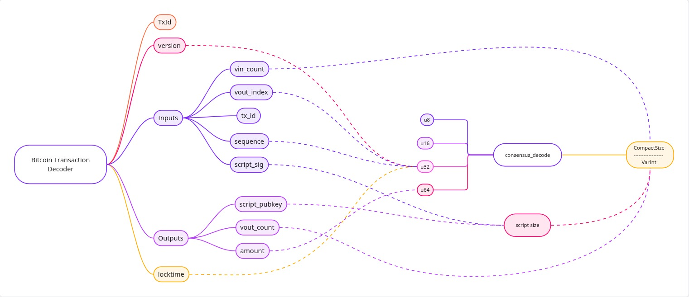
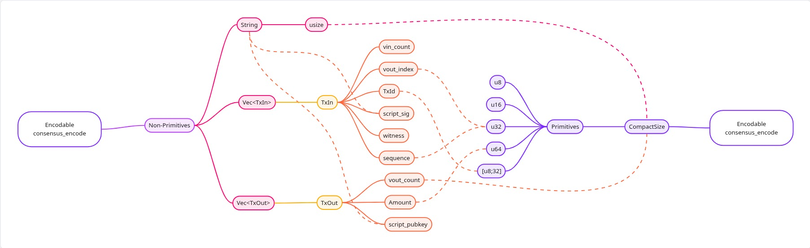

# Bitcoin_txn_decoder

Decode raw Bitcoin transactions into structured, readable data using Rust

This crate parses Bitcoin transaction hex strings (raw transactions) and decodes them into high-level structured objects. That means extracting fields like version, inputs, outputs, script data, locktime, and other core pieces of a Bitcoin transaction.

Bitcoin transactions are hex-encoded binary data used on the Bitcoin network to transfer value. This decoder makes the opaque raw format accessible to programs and humans alike.

---

## Usage Example

Decode a raw Bitcoin transaction:

### Sytnax
```rust
cargo run -- <hex_string>
```

### Example 
```rust
cargo run -- 0200000000010139c37be5cc98e9caadc9d1c5776b5c39f8c1f7719e76d7b8fd05088bc72581550100000000fdffffff024d1d000000000000225120400cf9059b68e59566a9a7f6b8df0f0d55717a0b524c9d3e40a78a8592f35d012c2a430000000000160014e8393fae87082359002c73774529709ab376a81e02483045022100c62cdf9fe5162f9c1d5343dd0bc83404d8662540a56fb7682540c167acdc3615022036a9105a0b1fd832e0052e63653e1a25866df78f9231992458b157eb765ce0d10121030661e39972d03ae75ab9bf31c6e84dfd071d56de48735fbfa3b8690d5c41f80500000000

```

---

## Design 

### Decodable Trait



### Encodable Trait




